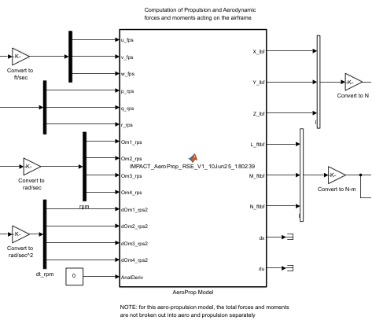
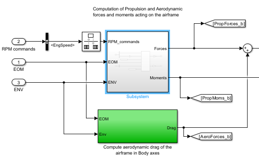
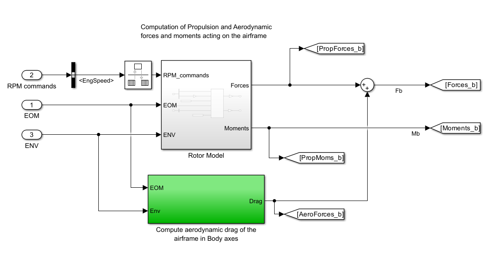
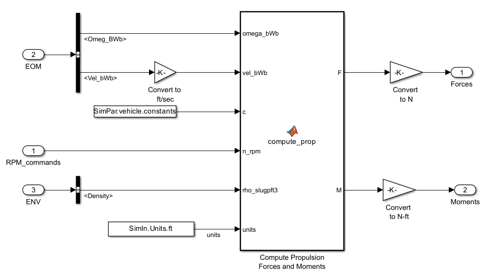
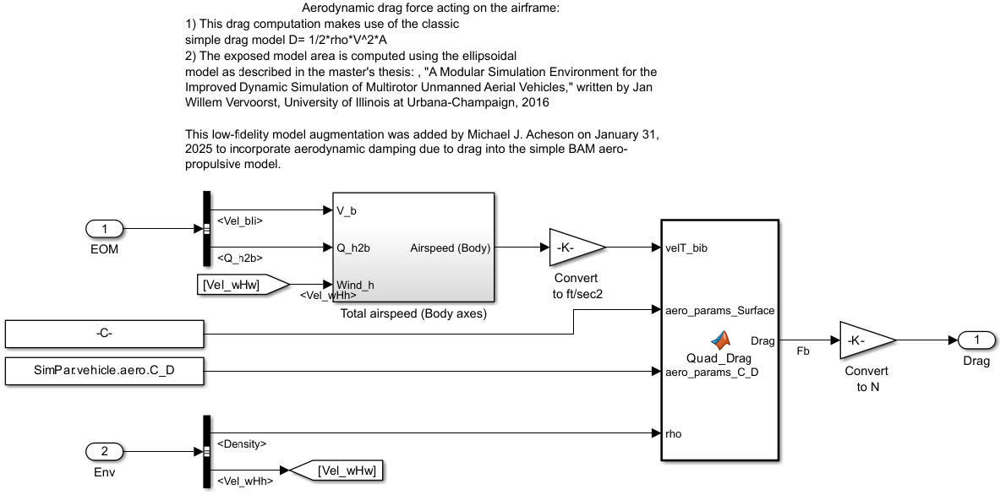
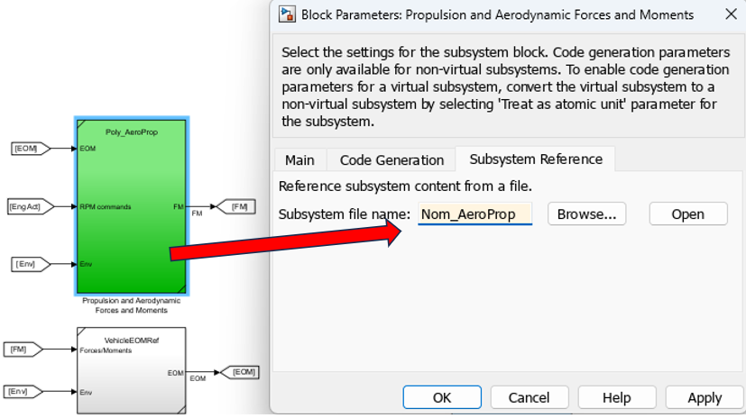
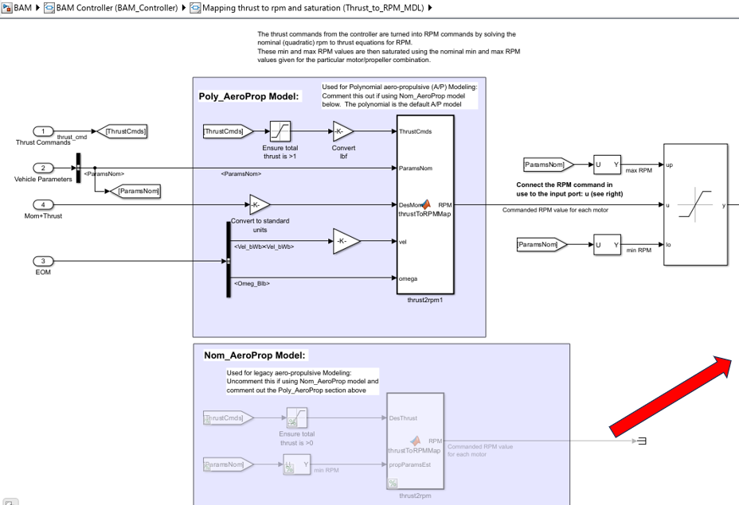
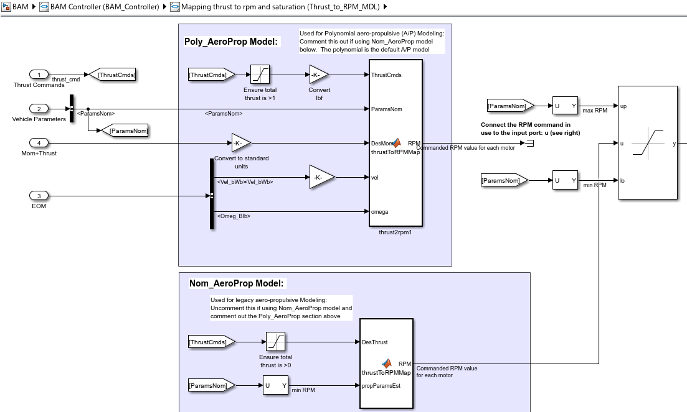
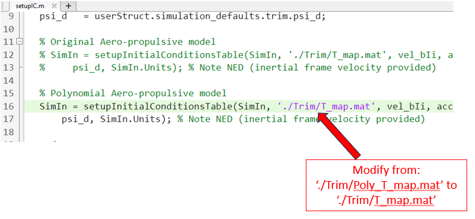
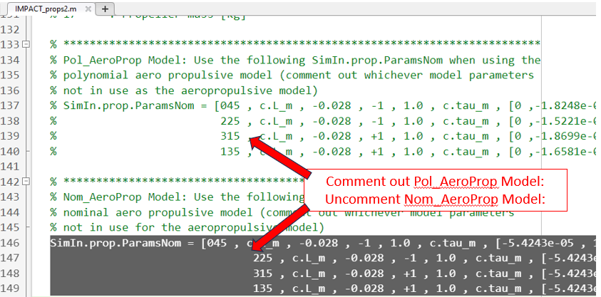

[Back to main](../README.md#api-documentation)

### Aero-Propulsive Modeling
The BAM simulation contains two aero-propulsive models, referred to as the polynomial and simple models, which are of two different fidelity levels.  The polynomial model was derived solely from flight data of a quad-rotor vehicle (see next paragraph for more details) and should be considered the higher fidelity model.  The simple model is a composite model based on a quadratic thrust  model (derived from manufacturer propeller thrust data) and a simplified drag model (based on generic quadrotor frontal area). In the BAM simulation, the polynomial model is intended for primary usage.  Two aero-propulsive models are provided with BAM to enable users to design a controller algorithm with a "known" model (i.e., simple model) and then fly with the actual or truth model (i.e., polynomial model). This dual aero-propulsive model capability is desirable to aid users in assessing their controller/algorithms robustness to modeling errors.  BAM users who want to utilize the simple model in the BAM simulation can do so, but not through the standard userStruct.variant process.  Instead, a [Manual Setup](#manual-setup) of the BAM simulation is required to use the simple model within BAM.  

#### Polynomial Aero-Propulsive Model
The BAM simulation primarily utilizes the polynomial aero-propulsive model.  This model was generated from flight data of the [IMPACT](https://ntrs.nasa.gov/citations/20240000223) quadrotor vehicle performing a variety of system identification maneuvers (e.g., doublets, multisines).  The flight data was analyzed and model identification was performed using [SIDPAC](https://software.nasa.gov/software/LAR-16100-1). Specifically, the SIDPAC equation error method was used to generate a hover polynomial response surface model. Due to the limited flight envelope of the quad-rotor, this single polynomial model sufficiently describes a substantial portion of the flight envelope (i.e, no blending between multiple response surface models was required.)  

The polynomial model is used in the BAM simulation in two ways.  First, it was used to generate trim tables for use in the simulation setup process (see [BAM Trim Process](../Trim/README.md)).  The polynomial trim table was generated using the m-script `/Trim/Gen_Trim_Map_Poly.m` which generated the trim table `Poly_T_map.mat`.  This resulting trim table file (i.e., `Poly_T_Map.mat`) is ONLY used during the BAM setup process to prescribe vehicle initial conditions and not used during BAM simulation execution.  The second way the polynomial model is used in the simulation is as a MATLAB function (m-script) that computes the aero-propulsive forces and moments during simulation execution which are necessary in the vehicle dynamics modeling. The MATLAB function (that contains the polynomial model) used during simulation is:  `IMPACT_AeroProp_RSE_V1_10Jun25_180239.m`. (Note: the simple aero-propulsive model was similarly used to generate a trim table with the associated files `/Trim/Gen_Trim_Map.m` and `T_map.mat` and could also be used as inputs to the vehicle dynamics modeling.)

The polynomial (left) and simple (right) models are shown in the figure below

The polynomial model uses the following inputs and outputs:
- Inputs: body frame velocity ($ft/sec$), body rates `p,q,r` ($rad/sec$), rotor speed ($rad/sec$) , rotor accelerations ($rad/sec^2$)

- Outputs: (body frame) `X, Y & Z` forces ($lbf$), and `L, M & N` moments ($ft \cdot lbf$)

It is expected that some users (e.g., machine learning community) may desire to have analytic solutions to the derivatives of the aero-propulsive model (i.e., $dx$, $du$). For this reason, optional analytic derivative outputs are available to the user.  The polynomial model has the additional input of an analytic derivative flag which specifies whether or not to output the derivative information.  The outputs of the analytic derivatives are not used in the BAM simulation (no bus structure was implemented), but the functionality exists for users if desired.

#### Simple Aero-Propulsive Model

As mentioned previously, the simple aero-propulsive model is provided with BAM primarily to enable users to utilize different models in controller/algorithm design and controller/algorithm execution.  The simple model is a composite model that contains a simple quadratic rotor propulsion model (rotor model subsystem) and a simple aerodynamic drag model (aerodynamic drag subsystem).  Both components are shown in the graphic below. From this graphic, it is easy to see the outputs of the simple propulsive model are the forces ($lbf$) and moments ($ft \cdot lbf$) for the rotor and aerodynamic forces only.  

The details of the rotor propulsion subsystem are shown in the graphic below.  This graphic shows that the inputs to the simple rotor model are body angular rates `p, q, and r` ($rad/sec$), body frame velocity including wind ($ft/sec$), rotor speed ($rpm$) commands, atmospheric density, and some vehicle parameters (e.g., rotor modeling coefficients).  Within this propulsion model subsystem the m-function `compute_multirotor_FM.m` is called to provide the propulsion forces and moments for the given inputs.

Similarly, the quadratic drag subsystem model (`Quad_Drag.m`) of the simple aero-propulsive model is shown below.  Here the inputs consist of total velocity, atmospheric density, and other vehicle parameters (frontal area approximation parameters, coefficient of drag). The outputs of this quadratic drag model are aerodynamic forces only.

 
 The combination of the propulsion and aerodynamic models described above constitute the simple aero-propulsive model in BAM.  

#### Manual Setup

In order to manually change the BAM simulation to use the simple model, the following four steps are required:

1. Change the aero-propulsive subsystem reference model from `Poly_AeroProp` to `Nom_AeroProp` (see graphic below).

2. Navigate to the `BAM Controller/Thrust to RPM MDL` Simulink block and the uncomment and connect the simple aero-propulsive model output as shown below:

3. Modify the `/setup/SimIn/setupIC.m` script (which sets the vehicle ICs) to use the simple aero-propulsive model trim table by providing the function `setupInitialConditionTable` function the argument `./Trim/T_map.mat` (see below):

4. Change the vehicle model parameters `SimIn.prop.ParamsNom` in the `/AeroProp/IMPACT_props2.m` file to use the simple aero-propulsive model instead of the polynomial parameters (see below):

Once this manual setup is complete, then rerun the `setup.m` script and the BAM simulation will now use the simple aero-propulsive model.  Reverse the procedure to switch back to the polynomial model.

[Back to main](../README.md#api-documentation) 