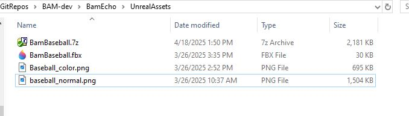
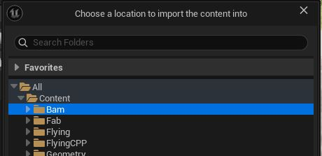
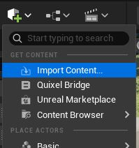

# BamEcho: Unreal Visualization & Video Generation Tool for BAM To Airsim Data 

[Back](../README.md#api-documentation)

**BamEcho Version:** 1.0

Sample "Scene" camera view from the front of Drone running off BAM data.

Sample "DepthVis" camera view from the front of Drone running off BAM data.

---

## Overview
This tool is designed to automate the process of taking a pregenerated BAM trajectory
data file, transmitting the trajectories contained to an Airsim Unreal Environment 
(one for the ownship drone and one for the baseball), and then generate a video from the
scene created.

---

## Getting Started

Generating videos with Bam Echo generally follows this process

1. Attain a flight run from BAM.

2. Run the flight data through `genBamEchoScenario` to obtain CSV files that Echo uses to create the video frame by frame.

3. Launch and run an Unreal Environment with Airsim.  (configure Airsim JSON file prior to launch for custom camera and sensors)

4. Run BamEcho with the CSV data files and all desired options to generate video files.

---

## Usage & Examples

The following is the standard format; two required parameters (the trajectory files) followed by any options to be activated.
`python BamEcho.py \<DroneTrajectory\> \<BaseballTrajectory\> [options]`
Also valid, assuming No Baseball options have been set, is the following where only one trajectory file argument is required:
`python BamEcho.py \<DroneTrajectory\> [options]`

## Examples

- `python BamEcho.py Drone_Scen01.csv Baseball_Scen01.csv` - Simple use.  Logs at a normal level. Uses Default values and naming conventions.
- `python BamEcho.py Drone_Scen02.csv Baseball_Scen02.csv -s` - Runs the program in Silent Mode.
- `python BamEcho.py Drone_Scen03.csv Baseball_Scen03.csv -v -t MyScenarioTag` - Runs the program in verbose mode; sets a custom tag for the output directories.
- `python BamEcho.py Drone_Scen01.csv -noBB -rm` - No Baseball use.  Just flys and records the multirotor, logs at a normal level, and removes the image file directories after video processing. Notice the second file argument is not required if no baseball mode is used at the command line or in the json configuration file.

---

## Options

- **'-s'** - Silent Mode.  Disables almost all text output.
- **'-v'** - Verbose Mode.  The most detailed console output available.
- **'-t'** - Tag name.  Allows user to set a custom string tag for the generated output.  Requires the user to input a string after the option flag on the command line. Usage: `python BamEcho.py <file1> <file2> -t <StringTag>`
- **'-dt'**- Debug Trajectory mode.  This allows testing of the trajectory visualization while disabling the time intensive image collection and video export routines.
- **'-noBB'**- Disables all activities with the baseball actor.
- **'-rm'**- Enable directory cleanup at the end; removes all the generated frame images, leaving just the the videos. 

---

## Requirements & Assumptions
This script is critically dependent on several compatibility assumptions with BAM and the chosen Unreal Airsim environment.  A lack of these items will likely result in failures by Echo or undefined behavior.

Assumptions:

- Python 3+ installed
- ffmpeg installed and on your path.
- ffmpeg-python python module installed.
- Run within (or on path) with `Airsim/PythonClient`.
- Bam Trajectories are given in CSV files with established format. (see tool `genBamEchoScenario.m`)
- An Airsim ready Unreal environment must be running.  For more information, see [Airsim Unreal Environment Supplemental](../ROS2_ws/visualization_pkgs/UNREALENVIRONMENT.md).
- Unreal environment has an asset that is spawnable named `BamBaseball`
- Unreal environment was configured with a JSON file that:
   * Sets the camera resolution (like using CameraDefaultSettings)
   * Instantiates at least one Airsim Multirotor vehicle named 'Drone'
   * Disables the Airsim physics by setting: `"PhysicsEngineName": "ExternalPhysicsEngine"` 

---

## Performance

This tool's speed is heavily dependent on two connected items: the size of the camera resolution that is being captured (defaults are Front Scene and Front Depth),
and the number of cameras being captured.  The biggest computational demand is `Client.simGetImages()`, and unfortunately it can't be spun off in a thread because it would 
create a race condition between what image is being captured and the scene being actively updated by the main transmission logic.  

Tips to speed up performance:

- Reduce resolution of target cameras.
- Reduce the number of cameras (dynamic camera system via `BameEcho.json`).
- Headless mode on the environment (Not available on all platforms.  I haven't tested this, but Airsim claims it works in Linux).

---

## BamBaseball Integration
Bam produces and transmits a multirotor and a baseball trajectory dataset into Airsim.  To properly leverage this in Airsim, the user's environment needs
to have an appropriate asset spawned that can be used as a baseball.  The BamEcho tool likewise needs to be able to move the baseball around
as it generates stills for the forthcoming video.  Since users have the flexibility to use whatever Unreal Environment that Airsim has been dropped
into, a common asset was created and provided to fulfill BamEcho's needs.

To integrate BamBaseball, do the following:

1. Locate the asset file (FBX) under `/BamEcho/UnrealAssets/BamBaseball.7z` and extract to a desired location. The folder contents should contain the following:

  

2. In Unreal Editor, create or select a folder location for the imported BamBaseball object.

  

3. Import the asset by selecting 'Import Content' from the 'Add' drop down button in Unreal Editor, and then select `BamBaseball.fbx` from `/BamEcho/UnrealAssets`.

Once completed the loaded asset should look like this:

4. Open the normal map texture named 'baseball_normal' and check that the 'Flip Green Channel' is enabled.

5. Place an instance of the BamBaseball static mesh in the level.  You may chose to hide it, or just move it somewhere it cannot be seen.  Note: it seems important for the asset to be instantiated.  Unreal only seems to add instantiated assets to the asset list.  It can not simply be left in the level's content drawer.

6. Rebuild and run the environment.  (BamEcho and Bam2Airsim will handle appropriate spawning and scaling).

---

## JSON Configuration File
The configuration file system allows for one place for holding and setting the default values for parameters and options being used in BamEcho;
with the exception of the raw input files.  The key feature that most users will likely want to leverage is the camera view options.  This section
will allow complete customization of which vehicle, camera, and image type (within the capability of Bam and Airsim) will be captured and processed
into a video product. Below is a listing of the parameters, explanation for each, and how to set them.

- *LogLevel* - (0-Silent, 1-Normal, 2-Verbose) - Sets the verbosity of the logging during execution (tied to -s and -v options).  Valid values: 0-Silent, 1-Normal, 2-Verbose/
- *ImageCapture* - (true, false) - Flags whether the script should capture images or not (useful if only testing trajectory transmission).  
- *VideoExport* - (true, false) - Enable or disable video exporting at the end.  Again, only really useful if testing data transmission.
- *IgnoreBaseball* - (true, false) - Enable or disable the transmission and processing of the Baseball actor.  This is useful if only concerned with the Drone's behavior.
- *CleanupFrames* - (true, false) - Enable or disable the deletion of generate image captures after execution.  This is a space saver if only concerned with the video output.
- *CompressFrames* - (true, false) - Enable or disable image compression from captures on PNG formats.
- *DefaultTag* - (text) A simple text title that will serve as the main part of the generated output folder.  Default value is "Echo".
- *VideoProcessing* - The items in this section allow configuration of the output video (may expand more in the future)
  * *InputFramerate* - (0-100) - This expressed the expected frame rate of the input files.  Currently unused, but will be used in the future for fine tunning ffmpeg.
  * *OutputFrameRate* - (0-60) - This expressed the desired video output framerate.  It can really be any positive integer, but really the 20-30 range the best bang for the buck.
  * *QualityFactor* - 5 - Lower numbers seem to be less lossy, but produce huge videos.  Higher numbers produce small but grainy videos. Five is the recommended selection.
- *CameraViews* - These items let the user set the basic cameras and image types they want captured and exported to video ultimate.  Only the Scene and Depth cameras have been experimented with.  The other Airsim supported cameras may require additional processing be added.
  * *Target* - ("Drone") Currently the system only supports one multirotor named Drone, but in the future this could be any known Airsim vehicle with onboard cameras.
  * *Camera* - (See Airsim documentation, https://microsoft.github.io/AirSim/) This is the name or number value of an onboard camera of the target vehicle.  The default used is 'front_center' or 0.
  * *Type* - (See Airsim documentation) This list is the the image types (vision types) that will be capture for this camera on this target vehicle. The defaults are "Scene" and "DepthVis".
   **Note**: The resolution for camera capture is actually configured in the main Airsim.json file for the Unreal environment.  If the user wishes to up or downgrade image quality, it must be done there for now.

---

## Obtaining BamEcho Scenario Data
Echo data is obtained by generating properly formatted CSV files from output data created by the BAM simulation in Matlab / Simulink or the autocoded BAM executable.

1. Configure and run BAM with the desired Ownship and Baseball criteria.

2. Once BAM has completed, run the tool `genBamEchoScenario` with the following inputs
    * *SimInData* - The structure of simulation input data; it should be in the main workspace called `SimIn` unless something went wrong.
    * *SimOutData* - The structure of values obtained from `simout.logsout{1}.Values`. simout can be found in the main workspace after BAM runs. 
    * *framerate* - (optional, default=24) - The rate at which frames are generated per second using the simulation dataset.
    * *tagString* - (optional, default='') - A string that will be included in the filename to customize it for recognition purposes.
    * *doBaseball*- (optional, default=logical(1)) - Flag to enable / disable baseball file generation.
  
    **Example Usage**: `Matlab>> genBamEchoScenario(SimIn, simOut.logsout{1}.Values);` 

    **Result**: Two files in the CWD of Matlab formatted as such: 
    
    - BamScn\_*timestamp*\_multirotor.csv 
    - BamScn\_*timestamp*\_baseball.csv
  
  3. Move files to a directory of your preference (like the BamEcho working directory), and use the files as appropriate in the command line arguments for BamEcho as described above.

---

## Ongoing & Future Work
- Dynamic video configuration
- Multi-vehicle support

---

## Questions / Contact
Daniel R. Hill - daniel.r.hill@nasa.gov

---

## Version History
  - **0.90** - Initial Beta.  Handles basic CSV parsing, transmission of Drone and baseball positions to Airsim,
               screen grabs of Scene and Depth cameras onboard the Drone vehicle, and exporting video to AVI via ffmpeg.
  - **0.95** - Added BamBaseball asset for Unreal Environments. Added the ability to create PFM videos with FFMpeg. Skip baseball option.
               Threading for Image saving. Image file cleanup after option.
  - **0.99** - Added JSON configuration file and dynamic camera view system. Allows the user more up front
               visibility to the options available in Echo, and a way to setup the desired camera views that
               will be exported to video.  Defaults are set as the current Dev preferences.  The camera views
               beyond Scene and Depth are nominally available, but have not been tested.  There may need to be 
               additional handling and processing logic implemented to handle the more complex views Airsim 
               provides (Done as needs arise.).
  - **1.00** - Full integration with baseball trajectory data.  Scenario data validation.

[Back](../README.md#api-documentation)
