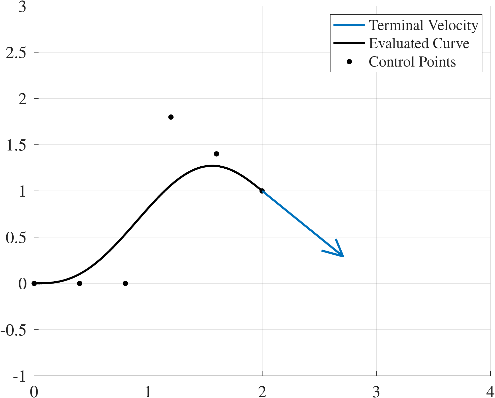

# Hermite Interpolation with Bernstein  Polynomials (Bézier Curves)

[Back..](../README.md#api-documentation)

This set of functions is focused on generating piecewise Bézier curves with applications to trajectory generation. Our method guarantees an arbitrarily high continuity constraint is met between segments while retaining the Bernstein parameterization. 
To generate these curves we solve the Hermite interpolation problem using Bernstein polynomials. 
These methods are particularly useful in trajectory generation applications where derivative constraints at boundary conditions must be satisfied when downstream algorithms may wish to differentiate the trajectory.
The Bernstein polynomial basis is a natural choice for trajectory planning because it has closed form solutions for the parameters of the integral and derivative of the polynomial. Furthermore, the polynomial parameters (called control points) can be used for a number of collision checking and bounding algorithms.

**Version:** 1.0


## Reference

This content is based on the work presented in:

[NASA/TM–20230013467](https://ntrs.nasa.gov/citations/20230013467): "On Hermite Interpolation using Bernstein Polynomials for Trajectory Generation" by Andrew Patterson, Gage MacLin, Michael Acheson, Camilla Tabasso, Venanzio Cichella, and Irene Gregory.

## [`interpHermBern`](./interpHermBern.m)

The `interpHermBern` function performs Hermite interpolation using Bernstein basis functions. This method is particularly useful where smooth curves through specified points with given tangents are required.

<center>

</center>

### Description

The `interpHermBern` function constructs a curve that passes through given points while satisfying specified derivative conditions at these points. 
Together the point and its derivatives form a waypoint (`wpts`). 
It utilizes the Hermite interpolation framework, which is enhanced by expressing polynomial terms in Bernstein basis form for numerical stability and downstream compatibility.

### Inputs

- **`wpts`:** A matrix where each column represents the points through which the curve must pass. The first column contains values at these waypoints, while the $k^\mathrm{th}$ column provides the $k^\mathrm{th}$ derivative. The first row of the matrix is the starting waypoint, the second row is the terminal waypoint of the polynomial segment.
  
- **`tint`:** A two-element vector `[a, b]` defining the interval over which the interpolation occurs.

### Outputs

- **`Q`:** A vector of control points for the interpolating curve in Bernstein basis representation. These control points define a polynomial that meets the specified conditions at `wpts`.


### Example Usage

```matlab
% Define the time interval of interest, t_0=0s t_1=2s
tint = [0 2];
% Define the waypoints,
% waypoint_0 [position=0, velocity=0, acceleration=0,...]
% waypoint_1 [position=1, velocity=1, acceleration=0,...]
wpts = [0 0 0;
        1 1 0];
% Run interpolation function
Q = interpHermBern(wpts, tint)'
% Take first and second derivatives to verify 
Q1 = diffBernControl(Q,tint,1)'
Q2 = diffBernControl(Q,tint,2)'
```
OUTPUT: 
```matlab
    Q = [0 0 0 0.2 0.6 1]
    Q1 = [0 0 0.5 1 1]
    Q2 = [0 1 1 0]
```
Note that ```Q([1 end])==wpts(:,1)'```, ```Q1([1 end])==wpts(:,2)'```, ```Q2([1 end])==wpts(:,3)'``` which, by the properties of the control points of a Bernstein polynomial, implies that the initial and final values of the position, velocity, and acceleration curves are correct.
### Dependencies
**Required**
- `binomCoeffs`

**Optional**
-  `diffBernControl`

### Limitations and Considerations
While theoretically, any order of derivative constraints can be considered, there are practical limitations to this parameterization due to floating point arithmetic.
The primary limitation of this code is in its reliance on repeated differences, computed using the `binomCoeffs` function. 
Repeated differences can lead to numeric issues. Two breakpoints to keep in mind are:

- The number of derivatives must be less than 25 to maintain precision.
- For practical implementations, ensure the number of derivatives is kept below 80 to avoid numerical issues like NaNs.

[Back..](../README.md#api-documentation)