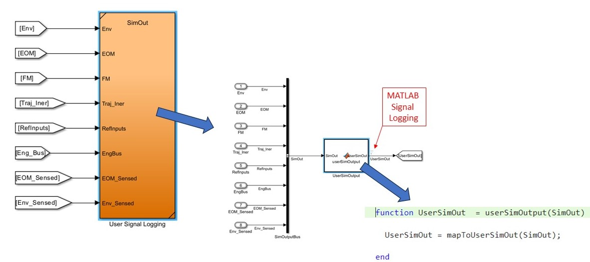

# User Defined Output

The upside of the BAM simulation is that it contains a wide array of signals/bus structures for most aerospace application needs. The downside is that recording all of these signals (for long simulations) results in massive data files.  For this reason, we have included a simple method for users to easily specify what signals should be logged when running the simulation.  More on this functionality to come.

## Background

First, a brief overview of the BAM data structures is warranted.  BAM uses the structure SimIn as the input structure to specify a wide array of aircraft and simulation setup constants.  These SimIn variables are "fixed" during the simulation setup processing.  Also during the setup process, a subset of SimIn signals are selected in [setupParameters.m](/setup/setupParameters.m) and assigned to the MATLAB tunable parameter object SimPar.  These SimPar fields are known to MATLAB to be tunable parameters and can therefore be easily modified during and between simulation runs.  Additionally, they don't get hardcoded as fixed values in any built code. The output data from the simulation makes use of the logging capabilities of MATLAB. There is one other data structure that is of interest to users which is named userStruct.  As the name suggests, this structure allows the user to specify simulation options during the setup process (specifically userStruct options must be specified before running the main simulation `setup.m` file).  This structure is used to do such things as specifying a desired variant for variant subsystems, specifying trajectory filenames, and (of interest for data logging) it is used for specifying a  filename for a custom user output data function (see data logging below).  

## Data Logging

BAM data logging is accomplished using MATLAB logging in a reference subsystem (see graphic below). This "User Signal Logging" subsystem (reference model named "SimOut") is found at the top-level of the simulation.  Inside this subsystem, the full SimOut bus is constructed and mapped into the MATLAB function block "UserSimOutput". This full SimOut bus is formed as a bus of busses structure which contains most of the signals of interest in the simulation (i.e., it's large). Note, this top-level bus object SimOut is constructed of bus objects all defined in [Bus_Definition](/setup/Bus_Definitions) folder. Users can write a MATLAB function m-file to specify a new data structure UserSimOut that can be tailored in any fashion containing only the signals of interest to the user from the full SimOut bus (i.e., much smaller!)  It is the user specified User_SimOut bus that is logged (stored as the variable logsout) using the MATLAB logging functionality shown below.  

<center>

</center>

As shown in the exploded view figure above, the function mapToUserSimOut creates the desired output signal bus UserSimOut for use with the MATLAB signal logging. There is a default UserSimOut file which assigns to UserSimOut the entire SimOut structure (see code below).  

```matlab
function [UserSimOut] = userOutFull(SimOut)

  UserSimOut.Env              = SimOut.Env;
  UserSimOut.EOM                = SimOut.EOM;
  UserSimOut.FM                 = SimOut.FM;
  UserSimOut.Traj_Iner          = SimOut.Traj_Iner;
  UserSimOut.RefInputs          = SimOut.RefInputs;
  UserSimOut.Misc.EngCmd        = SimOut.EngBus;
  UserSimOut.EOM_Sensed         = SimOut.EOM_Sensed;
  UserSimOut.Env_Sensed         = SimOut.Env_Sensed;
end
```
However, users can also write their own m-file function to tailor the desired output (see code below)

```matlab 
function [UserSimOut] = userCoolFunc(SimOut)
  UserSimOut.t                  = SimOut.Env_Sensed;
  UserSimOut.h                  = SimOut.EOM.InertialData;
  UserSimOut.i                  = SimOut.EOM.AirRelativeData.Vel_bWb;
  UserSimOut.s                  = SimOut.Traj_Iner.pos_i;
  UserSimOut.null.r             = SimOut.FM.Total;
  UserSimOut.null.o             = SimOut.FM.Propulsion.Force_b;
  UserSimOut.null.c             = SimOut.EOM_Sensed;
  UserSimOut.null.k             = SimOut.Env_Sensed.Wind.VelDtH_wHh;
  UserSimOut.null.s             = SimOut.Env;
end
```
Note a few important features of the tailored code above.  Specifically, the format of the UserSimOut structure on the LHS of the assignment statements is completely arbitrary.  Users can organize the UserSimOut structure fields (field names, subfields etc.) in any manner and can assign to it any individual fields from SimOut, a bus from SimOut or even a bus of buses from SimOut!  In this way, users can assign a UserSimOut structure with fields and names as desired (e.g., the data structure can be ingested by any of the user's legacy data analysis code which requires a specific format!)  Note, that while the BAM simulation comes with the predefined sub-bus objects necessary for the top-level bus SimOut, for a given user logging function, the top-level simulation script [setup.m](/setup.m) automatically creates bus objects for the new user defined top-level bus (UserSimOut) and any sub-buses!  After the completion of the `setup.m` script, these user defined bus object will be found in the MATLAB base workspace.  These new bus objects have the prefix "USER_" appended to them to differentiate them as user created bus objects. 

Astute readers may notice that the MATLAB function block from the exploded view above calls the mapToUserSimOut function and not (for instance) the example user function `userCoolFunc.m`.  So how does a user denote to use a specific user output function?  This is an example of where userStruct comes in.  In the code snippet below, the user output file userCoolFunc is chosen as the output file.

```matlab
userStruct.outputFunc = 'userCoolFunc'; % denotes to use the user specific output mapping function
setup; % Note setup must be run after designating the output function to create User bus objects etc.
```
In reality, what happens behind the scene is that the user function `userCoolFunc.m` gets copied and overwrites the `mapToUserSimOut.m` file in the [User_Output](/setup/User_Output) folder.  In this way, the user doesn't modify the simulation block which would be an issue trying to use an autocoded executable with several different user output mapping functions.